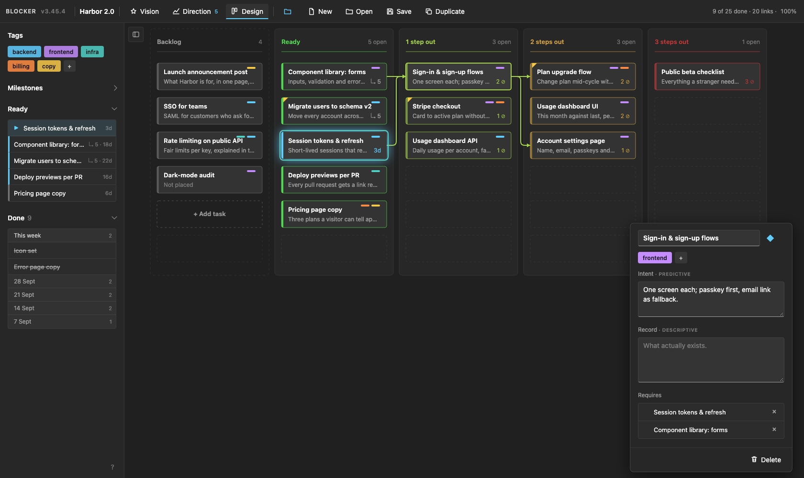
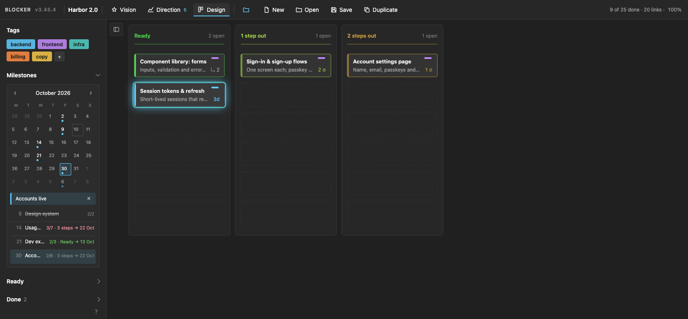
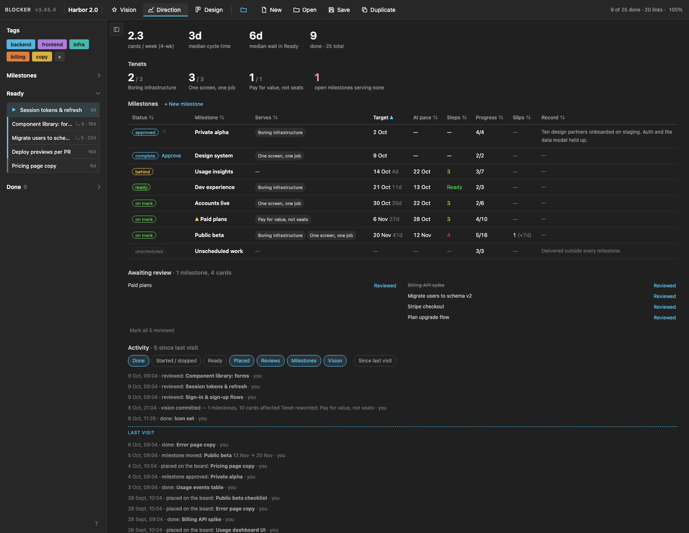
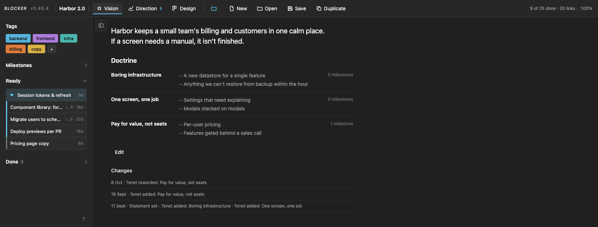
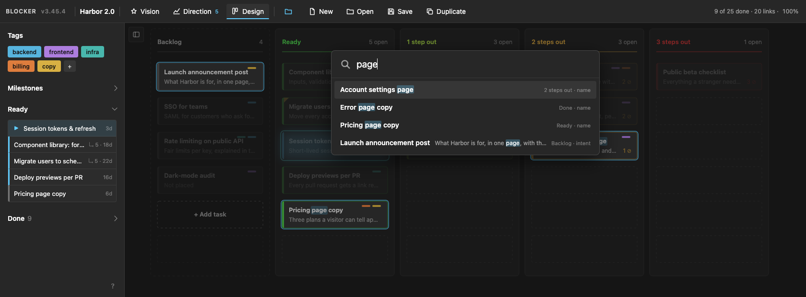

# Blocker

A planner that arranges work by what blocks it. Every card sits in a column given by how far it is from being startable — Ready, 1 step out, 2 steps out — so the board always answers the only question that matters on a given morning: *what can I actually start?*

It is a single HTML page with no build, no server and no dependencies. Open it in a browser and it works; your plan is a JSON file you save wherever you like.

> The screenshots show **Harbor 2.0**, a fictional project staged by hand to exercise every feature.

## What's in this repository

| File | What it is |
| --- | --- |
| `blocker.html` | The whole application: markup and script. This is the file you open. |
| `blocker.css` | Its stylesheet. Must sit next to `blocker.html`. |
| `CHANGELOG.md` | Version history, newest first, using semantic versioning. `VERSION` in `blocker.html` is the source of truth. |
| `docs/screenshots/` | The images in this README. |

## Getting started

1. Open `blocker.html` in **Chrome or Edge**. Other browsers work too, but can't write back to a file — Save downloads a copy, and Open uses an upload dialog.
2. Click **New** and name the project, or **Open** an existing `.json` plan.
3. Click **Save** once and choose where the file lives. From then on every change autosaves to that file, and the Save button disappears while the browser holds write permission.
4. Next time, Blocker reopens the last file by itself — or shows a single **Reopen ‹file›** button if the browser wants you to confirm access.

Until you save to a file, work lives only in the browser's session copy. Save early.

## The idea

A card has a **Name**, optional **tags**, an **Intent** and a **Record**, and a list of cards it **Requires**.

- **Intent** is predictive — what this should be, before it exists.
- **Record** is descriptive — what actually exists, once it does.

A few rules are enforced rather than suggested:

- A card can't leave the Backlog without an Intent.
- A card can't be marked Done without a Record, the way a commit can't be made without a message.
- Only **Ready** work can be started — a card is Ready when everything it requires is done — and only one card is in progress at a time.
- A requirement that would create a loop is refused.

## Design: the board

The board's columns are computed, not chosen. A card's column is the longest chain of unfinished prerequisites beneath it. The depth colour runs from green (Ready) through yellow to red (deep), and each column sorts itself: Ready by how much each card unblocks, deeper columns by how many blockers remain. Only the Backlog keeps your manual order.

On each card:

- **↳ 5** — a Ready card transitively unblocks five others.
- **2 ⊘** — a blocked card is still waiting on two prerequisites.
- **3d** — the in-progress card (with the blue glow) has been going for three days.
- **Coloured bars** in the top right are its tags; a **yellow corner** means a doctrine change is awaiting review (see [Vision](#vision-doctrine)).

Dependency arrows are drawn only for selected cards, so the board stays readable at a few hundred cards. Selecting a card opens its task window, which you can drag anywhere; it opens there from then on.

The sidebar holds:

- **Tags** — click one to filter the board; selecting several shows cards carrying *all* of them. Selected tags are applied to new tasks.
- **Milestones** — the calendar, below.
- **Ready** — what can be started, ordered by what each card unblocks, with how long it has been waiting.
- **Done** — finished work grouped by week; double-click an entry to reopen it.

To make a card depend on another, drag that card onto the **Requires** slot of the open task window. To finish the card in progress, drag it onto **Done** or press Done in its window.

## Milestones: the calendar

Milestones are dated promises made of cards. The calendar is the quickest way to make them:

- Press **◇** on an open card, then click a day. The card — or the whole selection — joins that day's milestone, or a new one is created and opened inline so you can name it on the spot.
- Dropping cards on a day does the same.
- Drag a milestone's entry onto another day to move it. Every move is recorded and counted as a slip.
- Click a day or an entry to **focus** it. The board, Ready and Done narrow to the milestone's *cone* — its parts and everything they transitively require — and new tasks join the focused milestone. Click again, or press Esc, to clear.

Each entry shows progress, remaining depth and the date it will land at the current pace, in red when that date is later than the target.

## Direction: promises against delivery

Direction is where the plan is held to account.

- **Pace** — cards finished per week over the last four weeks, median cycle time from start to done, and median time a card waits in Ready before someone starts it.
- **Tenets** — how many open milestones serve each tenet, and how many serve none.
- **Milestones** — one row per milestone, every column sortable. *At pace* is the projected finish at the current rate; *Steps* is the remaining dependency depth; *Slips* counts date moves and their net effect. Click a row to edit its name, date, tenets, Record and parts.
- **Unscheduled work** — finished cards that no milestone claims, so delivery outside the plan stays visible.
- **Awaiting review** — milestones and cards touched by a doctrine change, each with a Reviewed button.
- **Activity** — every state change, filterable, with a divider at your last visit. The badge on the tab counts what changed while you were away.

A milestone's status is one of:

| Status | Meaning |
| --- | --- |
| approved | Closed from Direction, with a written Record. |
| complete | Every card in its cone is done — waiting for approval. **Approve** asks for a Record first. |
| late | The target date has passed. |
| unreachable | Fewer days remain than dependency steps. |
| ready | Every part is Ready; the work can start today. |
| behind | At the current pace it lands after its target. |
| on track | At the current pace it lands on or before its target. |
| undated | It has no target date. |

## Vision: doctrine

The statement says what the project is for; the **tenets** under Doctrine say what it stands for, each followed by the ideas it rejects. Milestones declare which tenets they serve, in their Direction row.

Doctrine changes deliberately: **Edit**, then **Commit change**, and every commit is logged with its date. A commit also propagates downward. Rewording or removing a tenet flags every open milestone that serves it, and every card in those milestones' cones, as *awaiting review*; changing the statement flags every open milestone. A flag clears when the item is touched — its Record edited, the card finished, the milestone approved — or when it is explicitly marked reviewed.

## Search

Press **Space** anywhere outside a text field. Search matches card names, intents, records and tag names, plus milestones and tenets. Matching cards are highlighted on the board and everything else dims. Use the arrow keys and Enter to jump to a result.

## Keys

`Ctrl` is `⌘` on macOS.

| Input | Action |
| --- | --- |
| `Enter` | New task — it joins the focused milestone and the selected tags. In the task window: finish. |
| `Ctrl` + `Enter` | In the task window: finish and create the next task. |
| Click / `Shift`+click / `Ctrl`+click | Open a task / select a range / toggle selection. |
| Drag | Move between Backlog and board, or drop onto *Requires*, *Done*, a calendar day or a milestone entry. |
| Double-click | Backlog → Ready; Ready → in progress (on the board or in the Ready list); a Done entry → reopen. |
| `Del` | Delete the selected cards. |
| `◇`, then a day | Add the open card or the selection to that day's milestone, or create one. |
| `Space` | Search. |
| `Esc` | Close search, or clear the tag and milestone filters when nothing is selected. |
| `Ctrl` + `C` / `V` / `D` | Copy / paste / duplicate cards, links between them included. Paste works across projects. |
| `Ctrl` + `Z`, `Ctrl` + `Shift` + `Z` | Undo / redo, up to 100 steps. |
| `Ctrl` + `S` / `Ctrl` + `Shift` + `S` / `Ctrl` + `O` | Save / duplicate to a new file / open. |
| Wheel, `Ctrl` + wheel, drag empty space | Scroll, zoom, pan. Click the zoom figure to reset to 100%. |

The **?** at the bottom of the sidebar shows the same list inside the app.

## The project file

A plan is one JSON file holding the project name, vision, tags, milestones, cards, links, activity log and review history. Each save stamps the `appVersion` that wrote it, and older files are migrated when opened, so a plan made with an earlier version keeps working.

The file is pretty-printed with a stable key and card order, so plans diff cleanly under version control. Layout and camera state are deliberately left out — panning around never changes the file.

Interface preferences (open panes, active tab, window positions, filters) and a session copy of the current project are kept in the browser's `localStorage`. They belong to that browser only; the file is the source of truth.
